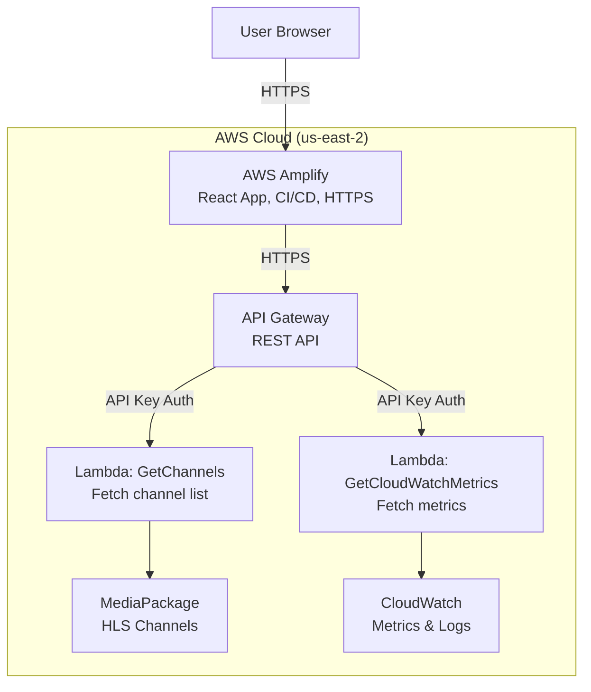

# HLS_Dash - LS-AMER LPV Dashboard

A real-time HLS livestream monitoring dashboard built with React and TypeScript, featuring multi-stream video playback and CloudWatch metrics integration.

---

## Overview

HLS_Dash is a web-based dashboard for monitoring and viewing multiple AWS MediaPackage HLS livestreams simultaneously. The application provides flexible layout options, real-time CloudWatch metrics, and a responsive interface for operations teams.

---

## Features

- **Multi-Stream Video Playback** - View 1, 2, 4, or 6 HLS streams simultaneously
- **Flexible Layouts** - Dynamic grid layouts with preset buttons for quick switching
- **CloudWatch Metrics Integration** - Real-time monitoring of stream health, bitrate, latency, and error rates
- **Channel Selection** - Dropdown selectors to switch between available MediaPackage channels
- **Persistent Preferences** - Layout preferences saved to browser localStorage
- **Responsive Design** - Adapts to different screen sizes and devices

---

## AWS Architecture



### Component Details

**AWS Amplify**

- Hosts React application
- Continuous deployment from GitHub
- HTTPS with SSL certificate
- URL format: `https://main.d[id].amplifyapp.com`

**API Gateway**

- Endpoint: `https://[api-id].execute-api.us-east-2.amazonaws.com/prod`
- Authentication: API Key (x-api-key header)
- Endpoints: `/channels` (GET), `/metrics` (POST)

**Lambda Functions**

- **GetChannels** - Queries MediaPackage for channel list
- **GetCloudWatchMetrics** - Fetches CloudWatch metrics

**AWS Services**

- **MediaPackage** - Provides HLS stream endpoints
- **CloudWatch** - Stores metrics (EgressBytes, RequestCount, ResponseTime, ErrorRate)

---

## Technology Stack

### Frontend

- React 18.2.0
- TypeScript 4.9.5
- HLS.js 1.6.15
- Webpack 5
- Babel 7

### AWS SDK

- @aws-sdk/client-cloudwatch 3.962.0
- @aws-sdk/credential-providers 3.962.0

### Build Tools

- webpack-dev-server
- ts-loader
- babel-loader
- html-webpack-plugin
- dotenv

---

## Project Structure

```
HLS_Dash-main/
├── src/
│   ├── components/
│   │   └── MetricsDashboard.tsx
│   ├── services/
│   │   └── cloudwatch.service.ts
│   ├── App.tsx
│   └── index.tsx
├── public/
│   └── index.html
├── .env
├── .env.example
├── .gitignore
├── package.json
├── tsconfig.json
├── webpack.config.js
└── README.md
```

---

## Setup Instructions

### Prerequisites

- Node.js 18+ and npm
- AWS Account with appropriate permissions
- GitHub account (for Amplify deployment)

### Local Development

**1. Clone the repository**

```bash
git clone https://github.com/TroyGuter/HLS_Dash.git
cd HLS_Dash-main
```

**2. Install dependencies**

```bash
npm install
```

**3. Configure environment variables**

Create a `.env` file in the project root:

```
REACT_APP_API_URL=https://[your-api-id].execute-api.us-east-2.amazonaws.com/prod
REACT_APP_API_KEY=your_api_key_here
```

**4. Start development server**

```bash
npm start
```

The app will open at `http://localhost:3000`

**5. Build for production**

```bash
npm run build
```

Output will be in the `dist/` directory

---

## AWS Setup

### 1. MediaPackage Channels

- Create MediaPackage channels in us-east-2 region
- Configure HLS endpoints
- Note channel IDs and descriptions

### 2. Lambda Functions

**GetChannels Lambda**

- Runtime: Node.js 20.x
- Handler: index.handler
- Permissions: MediaPackage read access

**GetCloudWatchMetrics Lambda**

- Runtime: Node.js 20.x
- Handler: index.handler
- Permissions: CloudWatchReadOnlyAccess

### 3. API Gateway

1. Create REST API
2. Create resources: `/channels` and `/metrics`
3. Create methods:
   - `GET /channels` → GetChannels Lambda
   - `POST /metrics` → GetCloudWatchMetrics Lambda
4. Enable CORS on both endpoints
5. Create API key and usage plan
6. Deploy to `prod` stage

### 4. Amplify Deployment

1. Go to AWS Amplify console
2. Click "New app" → "Host web app"
3. Connect GitHub repository
4. Configure build settings:

```yaml
version: 1
frontend:
  phases:
    preBuild:
      commands:
        - npm install
    build:
      commands:
        - npm run build
  artifacts:
    baseDirectory: dist
    files:
      - '**/*'
  cache:
    paths:
      - node_modules/**/*
```

5. Add environment variables:
   - `REACT_APP_API_URL`
   - `REACT_APP_API_KEY`
6. Deploy

---

## Usage

### Layout Selection

Click preset buttons in the header to switch between layouts:

- 1 Player
- 2 Players
- 4 Players
- 6 Players

Layout preference is automatically saved to browser localStorage.

### Channel Selection

Use dropdown menus below each video player to switch between available channels. Channel names are fetched from MediaPackage via API Gateway.

### CloudWatch Metrics

Click the "← Metrics" button on the right side of the screen to view real-time metrics:

- **Bitrate** - Data transfer rate (Mbps)
- **Requests** - Number of viewer requests
- **Latency** - Average response time (ms)
- **Error Rate** - Percentage of failed requests

Metrics auto-refresh every 60 seconds. Toggle auto-refresh on/off as needed.

---

## Metrics Explained

### Bitrate (Mbps)

Calculated from EgressBytes over 5-minute periods. Indicates stream quality and bandwidth usage.

**Typical values:**

- SD: 1-3 Mbps
- HD: 3-6 Mbps
- Full HD: 5-10 Mbps

### Requests

Total HTTP requests to MediaPackage endpoint. Each viewer makes 6-30 requests/minute depending on segment duration. Use to estimate viewer count.

### Latency (ms)

Average response time from MediaPackage.

**Performance indicators:**

- Excellent: < 100ms
- Good: 100-200ms
- Acceptable: 200-500ms
- Poor: > 500ms

### Error Rate (%)

Percentage of requests with 4xx/5xx status codes.

**Health indicators:**

- Excellent: < 1%
- Good: 1-5%
- Concerning: > 5%
- Critical: > 10%

---

## Security

- **API Key Authentication** - All API Gateway requests require x-api-key header
- **Environment Variables** - Sensitive credentials stored in Amplify environment variables
- **HTTPS Only** - All traffic encrypted via SSL/TLS
- **IAM Roles** - Lambda functions use least-privilege IAM roles
- **CORS Configuration** - Restricted to necessary origins

---

## Troubleshooting

### Videos Not Loading

- Check MediaPackage channel status in AWS console
- Verify API Gateway endpoint is accessible
- Check browser console for CORS errors
- Confirm API key is valid and associated with usage plan

### Metrics Not Displaying

- Verify Lambda function has CloudWatch read permissions
- Check Lambda logs in CloudWatch for errors
- Ensure `/metrics` endpoint is deployed in API Gateway
- Confirm channels have recent activity (metrics require data)

### Build Failures

- Clear webpack cache: `rm -rf dist`
- Delete node_modules and reinstall: `npm install`
- Check for TypeScript errors: `npx tsc --noEmit`

### Amplify Deployment Issues

- Verify environment variables are set in Amplify console
- Check build logs for errors
- Ensure `baseDirectory: dist` is correct in build settings
- Confirm `index.html` exists in dist folder after build

---

## Contributing

1. Fork the repository
2. Create a feature branch: `git checkout -b feature-name`
3. Commit changes: `git commit -m 'Add feature'`
4. Push to branch: `git push origin feature-name`
5. Submit a pull request

---

## License

This project is proprietary and confidential.

---

## Support

For issues or questions, contact the LS-AMER LPV team.

---

## Changelog

### Version 1.0.0 (January 2026)

- Initial release
- Multi-stream HLS video playback
- Layout selector (1, 2, 4, 6 players)
- CloudWatch metrics integration
- API Gateway + Lambda backend
- AWS Amplify deployment
- Webpack 5 build system with environment variable support
